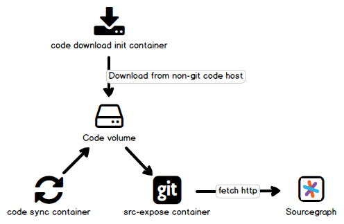

# src-expose demos

The [`src-expose` CLI](https://docs.sourcegraph.com/admin/external_service/non-git) can sync changes to git and ordinary directories and serve them over http.

The purpose of this repo is to provide working code examples for both Docker and Kubernetes that can be used for testing `src-expose` and as reference that can adapted for customer specific implementation.

## The code

This repo operates under the assumption that the best documentation is working code, not code snippets that can fall out of date and stop working.

Therefore, everything works by running commands via `make` and the `Makefile` is your source of truth for how things work and what code is being executed.

## Requirements

- Make
- Git
- Docker
- Kubernetes

## Usage

There are two use cases covered here, both of which have Docker and Kubernetes examples.

1. Serve a list of non-git code (ordinary folders)
1. Serve git repositories found in a parent folder

## Using Docker

Runs a single container using the `sourcegraph/src-expose` image and expects git repos and ordinary code directories to be found and mounted from the `./code` directory in this repository.

Run `./resources/code-download.sh` before running the Docker commands to populate the `code` directory, or you can alter the `Makefile` so existing code is mounted from your local machine.

### To serve ordinary code directories

Notice in the `Makefile` that we're using a custom `--entrypoint` argument of `/app/bin/entry.sh`. The reason for this, is because by default, `src-expose` expects a list of directories to be passed to it, if not using the `serve` command. This custom script creates a list of the directories in the `/app/data` directory, then passes that to `src-expose` so you don't have to manually create this list.

To serve ordinary directories as git repositories:

```sh
make docker-code-dirs
```

### To serve existing git repositories

Many customers have used a CLI tool to convert repositories from a non-git VCS into a git repository, but this does not include serving these repositories over HTTP. This is what `src-expose serve` is for, which has saved many customers the trouble of running a code host, purely for the purposes of serving local git repositories.

To serve git repositories, we use `src-expose serve`:

```sh
make docker-git-repos
```

### Creating the external service in Sourcegraph

Once you have the `src-expose` container running, you need to configure Sourcegraph to index the available repositories. To do this:

1. Go to **Site admin** > **Manage repositories** > **Add repositories**
1. Select **Generic Git host**
1. Paste the following:

```json
{
  "url": "http://<host ip address>:3434",
  "repos": [
    "src-expose"
  ]
}
```

If running Docker for Desktop, you can use the hostname of `host.docker.internal:3434`, or you'll need the IP address or fully qualified hostname of the host machine running the `src-expose` container.

---

## Using Kubernetes

To make things easy, we use a self-contained single Pod with 2 containers, one for syncing code, and the other for `src-expose` that both share the same volume that holds the code to be served.

An init container is responsible for downloading the code to be served before the `src-expose` container is started which avoids the need to bind the Pod to a specific host in order to use a `hostPath` volume.

Whether using an init container to download all code required for the Pod depends upon the size of the code being served, but hopefully this gives you an initial design to get started.



### The code sync container

The code sync container is merely to demonstrate how such a container might be used but the implementation itself is demo quality only.

It either downloads and extracts zip files to simulate non-git code syncing, or clones and pulls git repositories to simulate directly serving git repositories.

### Customizing these examples to serve your code

To customize to use your own code, either replace the code sync container with your own implementation, or you can eliminate the need for a code sync container if mounting the code from the node into the container via a `hostPath` volume or PersistentVolumeClaim (PVC).

### Serving ordinary code directories

The [code-dirs.yaml](code-dirs.yaml) file has the service and deployment for serving ordinary code directories:

```sh
make k8s-code-dirs
```

Once the init container has finished downloading code, you'll be able to access the `src-expose` service externally at `http://localhost:30034`, and inside the cluster at `http://src-expose-code-dirs:3434`.

### Serving git repositories

The [git-repos.yaml](git-repos.yaml) file has the service and deployment for serving git repositories:

```sh
make k8s-git-repos
```

### Creating the external service in Sourcegraph

The URL you will use for Sourcegraph to communicate with the `src-expose` service will depend on how you have deployed Sourcegraph. The above deployment options provide both an internal and external URL and this guide presumes the reader knows Docker and Kubernetes sufficiently well to know which one to chose.

Once you have the `src-expose` Pod running, you need to configure Sourcegraph to index the available repositories. To do this:

1. Go to **Site admin** > **Manage repositories** > **Add repositories**
1. Select **Generic Git host**
1. Paste the following:

```json
{
  "url": "http://<internal or external hostname/ip>:3434",
  "repos": [
    "src-expose"
  ]
}
```

### Cleaning up deployments

To remove all Kubernetes resources, run:

```sh
make k8s-delete
```

## FAQs

### How long does it take for changes to local code to be reflected in Sourcegraph?

Approximately one minute but this can vary. To force Sourcegraph to pull the latest changes, navigate to any repository, go to to **Settings** > **Mirroring**, then click on **Refresh now**. You can also increase the speed at which Sourcegraph indexes code changes by going to **Site admin** > **Configuration**, then setting `search.index.enabled` to `false`, but note this is only something you would want to do for demo purposes.
